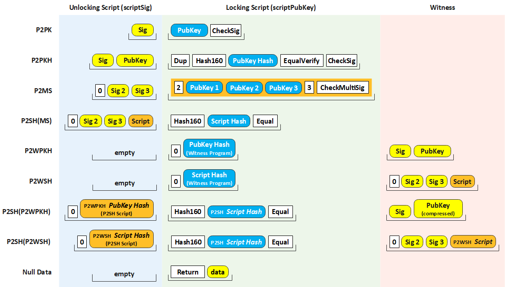

## 安装
```bash
go get github.com/zlabwork/go-wallet

go get github.com/zlabwork/go-wallet@v1.4.0
```
## BTC
```golang
// 地址与私钥
import "github.com/zlabwork/go-wallet/btc"

priKey := btc.NewPriKeyRandom()
priKey.WIF() // L211iZmidtxLQ2s7hzM9BYacPUu2asT1KkCkyrTbNbDib2N85ai5
pubKey := priKey.PubKey()
address1 := pubKey.Address().P2pkh() // 19c4pkCL2jvTFYkZXDyUHi4ceoNze44mXE
address2 := pubKey.Address().P2sh()  // 3AJ5kHgmaeEqLiSzeKe4iLRYoKfiCH5Y1C
```
```golang
// 交易
import "github.com/zlabwork/go-wallet/btc"

// 配置
// btc.SetNetwork("testnet")
c := &btc.HandleConfigs{
    Host: "http://127.0.0.1:18443",
    User: "user",
    Pass: "pass123456",
}
cli := btc.NewServiceClient(c)

// 输入 [tx:vout]
ins := map[string]uint32{
    "47c1c015beceb04c9772bb0575366078bc1f26edaf7bd271a1e31369ee1a88a3": 0,
    "166858e738b77da7164a26e17f5bf2ffc6cfec0c10537a3810306aa9a3d0b309": 0,
}
// 输出
outs := map[string]int64{
    "bc1q7k85507tl9n2aguczwkjn9ytjvjvtc07g5yqsk": 2499000000, // 24.99 BTC
    "1MVf99Vv8ZbFXXL4UwUnQbTLaAphBNeGFW":         2499000000, // int64(24.99 * math.Pow10(8))
}
// 生成交易 chargeBack 为找零地址
// b, err := cli.CreateTransferAll(ins, "1PPQCxxDqSpjxu8N2kEkEimrfUcpWT4Duc", 10)
b, _ := cli.CreateTXUseMap(ins, outs, "", 10, "1PPQCxxDqSpjxu8N2kEkEimrfUcpWT4Duc")
// 交易签名
signedHex, _ := cli.SignRawTX(b, []string{"cUQMEcP7RA8jJ32hghcCwSv55o29SzwS77LpZ5GSU5fsNi3tHFXc"})
// 发送交易数据
txId, err := cli.SendRawTX(signedHex)
```


## BCH
```golang
import "github.com/zlabwork/go-wallet/bch"

priKey := bch.NewPriKeyRandom()
address := priKey.PubKey().Address().P2pkh()
log.Println(address) // qzz6eq5we2qdxg29jkzxkxafc34xhduk7vhayz3z06
```


## ETH
```golang
import "github.com/zlabwork/go-wallet/eth"

priKey := eth.NewPriKeyRandom()
priKey.Address().String()

// 测试网络
handle, _ := eth.NewServiceHandle("http://127.0.0.1:8545")
handle.GetBalance("0x06****11")

// 正式网络 
// https://infura.io/ 需要申请一个KEY
// eth.NewServiceHandle("https://mainnet.infura.io/v3/xxxxxxxx")
// eth.NewServiceHandle("wss://mainnet.infura.io/ws/v3/xxxxxxxx")
```

## ETH 合约
```golang
// prikey is keystore json file string
priKey := `{"address":"070036c8934faa2a04c8ed042cb1532281111111","crypto":{"cipher":"aes-128-ctr","ciphertext":"","mac":""},"id":"","version":3}`
contractAddr := common.HexToAddress("0x3B30d8eC339a1B2229aeFaf65673586638D75a4d")
myAddr := common.HexToAddress("0x070036c8934faa2A04c8ed042cb1532281111111")
toAddr := common.HexToAddress("0x6771C0068ae24ac6602831DceA34b1764C69c2b8")

// 1. conn
conn, err := ethclient.Dial("http://127.0.0.1:8545")
if err != nil {
    log.Fatalf("Failed to connect to the Ethereum client: %v", err)
}

// 2. contract with address
token, err := contract.NewToken(contractAddr, conn)
if err != nil {
    log.Fatalf("Failed to instantiate a Token contract: %v", err)
}

// get info
token.Name(nil)              // get name
token.Symbol(nil)            // get symbol
token.BalanceOf(nil, myAddr) // get balance

// 3. auth
auth, err := bind.NewTransactorWithChainID(strings.NewReader(priKey), "secret password", big.NewInt(999))
if err != nil {
    log.Fatalf("Failed to create authorized transactor: %v", err)
}

// 4. transfer 2 token
tx, err := token.Transfer(auth, toAddr, big.NewInt(2000000000000000000))
if err != nil {
    log.Fatalf("Failed to request token transfer: %v", err)
}

// tx hash
fmt.Println(tx.Hash().String())
```


## Transaction
[Standard Pubkey Script](https://developer.bitcoin.org/devguide/transactions.html)  
[Deconstructing Transactions](https://www.royalfork.org/2014/11/20/txn-demo/)  

1. Pay To Public Key Hash (P2PKH)  
2. Pay To Script Hash (P2SH)  
3. Multisig  
4. Pubkey  
5. Null Data  


```bash
# P2PKH
Pubkey script: OP_DUP OP_HASH160 <PubKeyHash> OP_EQUALVERIFY OP_CHECKSIG
Signature script: <sig> <pubkey>

# P2SH
Pubkey script: OP_HASH160 <Hash160(redeemScript)> OP_EQUAL
Signature script: <sig> [sig] [sig...] <redeemScript>

# Multisig
Pubkey script: <m> <A pubkey> [B pubkey] [C pubkey...] <n> OP_CHECKMULTISIG
Signature script: OP_0 <A sig> [B sig] [C sig...]

# Pubkey
Pubkey script: <pubkey> OP_CHECKSIG
Signature script: <sig>

# Null Data
Pubkey Script: OP_RETURN <0 to 40 bytes of data>
(Null data scripts cannot be spent, so there's no signature script.)
```

## Bitcoin Transaction
  

  


## HD Wallet Example
[HD Wallet Example](docs/HDWallet.md)  


## 钱包工具
* http://webhdwallet.github.io/  
* https://iancoleman.io/bip39/  
* https://www.bitaddress.org/  


## Docs
##### 1. articles
[椭圆曲线文档](http://www.secg.org/sec2-v2.pdf)  
[Graphical Address Generator](https://www.royalfork.org/2014/08/11/graphical-address-generator)  

##### 2. bch
[BCH地址规则](https://github.com/bitcoincashorg/bitcoincash.org/blob/master/spec/cashaddr.md)  
[https://github.com/gcash/bchutil](https://github.com/gcash/bchutil)


##### 3. wallet
[bip-0044](https://github.com/bitcoin/bips/blob/master/bip-0044.mediawiki)  
[钱包兼容性汇总](https://bitcoinops.org/en/compatibility/)  

##### 4. transactions
[btc transactions](https://developer.bitcoin.org/reference/transactions.html)  
[btc Script](https://en.bitcoin.it/wiki/Script)  


## Tools
[椭圆曲线图形](https://www.desmos.com/calculator/ialhd71we3?lang=zh-CN)  
[SegWit address format](http://bitcoin.sipa.be/bech32/demo/demo.html)  


## Similar Tools 
[python bitcoin-utils](https://pypi.org/project/bitcoin-utils/)  
